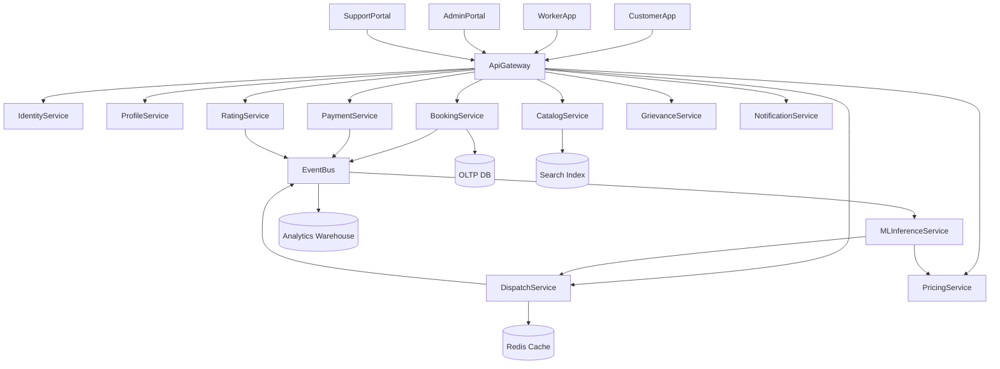

# Enterprise Architecture Blueprint - KaamChor

## 1) Architecture Objectives

- Support multi-actor workflows (customer, worker, admin, support).
- Enable high reliability for hyperlocal dispatch and job lifecycle.
- Provide enterprise-grade security, auditability, and scale path.
- Keep ML integration modular (not tightly coupled to transaction path).

## 2) Logical Architecture (high level)




## 3) Service Boundaries and Ownership


| Service             | Responsibility                             | Owns Data                              | Notes                                             |
| ------------------- | ------------------------------------------ | -------------------------------------- | ------------------------------------------------- |
| IdentityService     | AuthN/AuthZ, sessions, device trust        | User credentials, tokens, auth events  | OAuth2/JWT with short-lived access tokens         |
| ProfileService      | Customer/worker profiles, KYC status refs  | Profile, addresses, language pref      | KYC artifacts stored via secure object store refs |
| CatalogService      | Service SKUs, rates, add-ons, zone mapping | Category/SKU catalog, city-zone matrix | Versioned catalog for safe rollouts               |
| BookingService      | Booking lifecycle state machine            | Booking record, timeline, job metadata | Source of truth for booking state                 |
| DispatchService     | Worker discovery, assignment, retries      | Assignment records, dispatch decisions | Uses cache + geo indexes                          |
| PricingService      | Fare/quote computation and guardrails      | Price rules, dynamic factors           | Deterministic pricing logs required               |
| PaymentService      | Collections, refunds, settlements          | Transactions, payout ledgers           | Integrates PG + UPI rails                         |
| RatingService       | Reviews, quality signals                   | Rating and feedback events             | Feeds worker quality scoring                      |
| GrievanceService    | Disputes, incidents, escalations           | Ticket and resolution logs             | Regulatory response SLA linked                    |
| NotificationService | SMS/WhatsApp/push/email                    | Delivery logs, templates               | Multi-channel failover                            |
| MLInferenceService  | Online scoring (ETA/fraud/match score)     | Feature snapshots + predictions        | Non-blocking fallback path needed                 |


## 4) Domain Data Model (core entities)

- `User` (customer/worker/admin)
- `WorkerProfile` (skills, certs, KYC status, score)
- `ServiceCategory` and `ServiceSKU`
- `Booking` (request, scheduled slot, status, price, location)
- `Assignment` (worker offers, acceptance, retries)
- `PaymentTransaction` (auth/capture/refund/reversal)
- `Review` and `QualityIncident`
- `SupportTicket`
- `AuditLogEntry`

## 5) Key Data Contracts (event-driven)

## 5.1 Canonical event envelope

```json
{
  "eventId": "uuid",
  "eventType": "booking.created",
  "eventVersion": "1.0",
  "occurredAt": "2026-04-14T10:00:00Z",
  "producer": "BookingService",
  "traceId": "trace-uuid",
  "tenantId": "india",
  "payload": {}
}
```

## 5.2 Mandatory event topics

- `booking.created`
- `booking.confirmed`
- `booking.cancelled`
- `dispatch.worker_offered`
- `dispatch.worker_assigned`
- `dispatch.assignment_failed`
- `service.started`
- `service.completed`
- `payment.authorized`
- `payment.captured`
- `payment.refunded`
- `quality.complaint_raised`
- `grievance.escalated`

## 5.3 Contract rules

- Backward-compatible schema evolution only.
- Schema registry required for all event topics.
- Consumer idempotency key mandatory (`eventId`).
- Replay support for 7 days minimum (pilot), 30 days target.

## 6) API Standards

- REST for synchronous commands/queries.
- Async events for state propagation and analytics.
- Versioned APIs (`/v1/...`), deprecation with sunset dates.
- Error envelope standard with machine-readable `errorCode`.
- Idempotency keys required on booking create, payment capture, refund APIs.

## 7) Storage and Infrastructure Blueprint

- **OLTP:** PostgreSQL (city-partitioning strategy optional at scale).
- **Cache:** Redis for dispatch hot paths and rate limiting.
- **Search:** OpenSearch/Elasticsearch for discoverability and ops queries.
- **Event bus:** Kafka/PubSub equivalent for event-driven workflows.
- **Object store:** KYC and evidence artifacts with encryption-at-rest.
- **Warehouse:** BigQuery/Snowflake/Redshift class for analytics and BI.
- **Container orchestration:** Kubernetes with HPA and pod disruption budgets.

## 8) Observability Standards (enterprise baseline)

## 8.1 Metrics (golden signals)

- Latency (p50/p95/p99) by API and service.
- Traffic (RPS, booking attempts, assignment attempts).
- Errors (5xx, domain errors, payment failures, dispatch failures).
- Saturation (CPU/memory, DB connections, queue lag, cache hit ratio).

## 8.2 Business SLOs (pilot)

- Booking API availability >= 99.9%
- Dispatch success within SLA >= 95%
- Payment success rate >= 98.5%
- Notification delivery success >= 98%

## 8.3 Tracing and logging

- OpenTelemetry instrumentation mandatory for all services.
- End-to-end trace IDs propagated via headers and events.
- Structured JSON logs only; PII redaction in logging pipeline.
- Audit logs write-once retention policy for compliance-critical actions.

## 8.4 Alerting and incident management

- Severity model: Sev1/Sev2/Sev3 with runbooks.
- Alert on SLO burn rate, queue lag spikes, payment failure spikes.
- 24x7 on-call rotation for production systems.

## 9) Security Architecture (summary)

- Zero-trust service-to-service auth (mTLS + workload identity).
- Secrets manager for keys/tokens, no plaintext secrets in configs.
- WAF + rate limiting + bot protection at edge.
- Encryption in transit (TLS1.2+) and at rest (KMS-managed keys).

## 10) Release Strategy

- CI/CD with mandatory tests, security scans, and schema checks.
- Blue/green or canary rollouts for high-risk services.
- Feature flags for incremental rollout by micro-zone and category.
- Rollback objective: <15 mins for failed production deploys.

## 11) Scalability Targets (first 12 months)

- Design baseline for:
  - 100K MAU customers,
  - 20K MAU workers,
  - Peak 1,500 concurrent active bookings.
- Stress-test dispatch and payment services at 3x projected peak.

